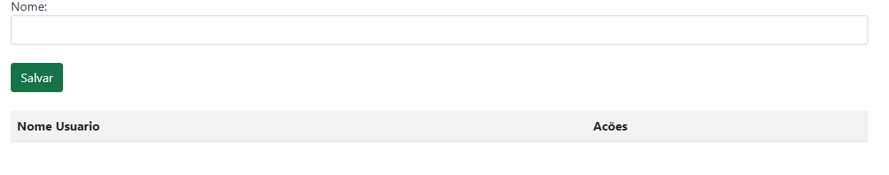
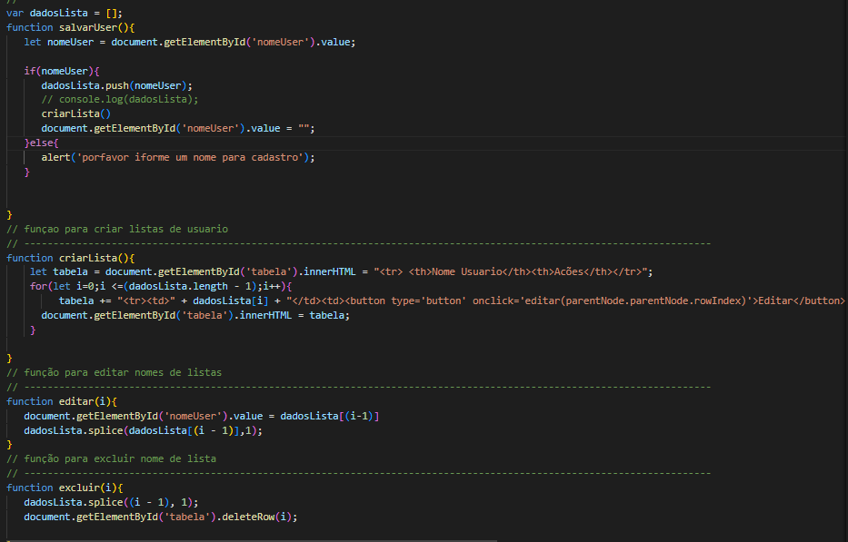

# tela de cadrastro


## este trabalho foi dessenvolvido para cadreastrar nomes, e ao mesmo tempo pode eliminae ou editar o nome das pessoas, não tendo limite de nomes para cadastrar.

 
 
 
 


para realizar a função de eliminar e editar os nome foi usando javaScript
  
  
  ``` 
  var dadosLista = [];
function salvarUser(){
   let nomeUser = document.getElementById('nomeUser').value;

   if(nomeUser){
      dadosLista.push(nomeUser);
      // console.log(dadosLista);
      criarLista()
      document.getElementById('nomeUser').value = "";
   }else{
      alert('porfavor iforme um nome para cadastro');
   }


}

   ```
   FUNÇÃO PARA ARMAZENAMENTO DE NOMES EM ARRAY

   ARRAY:Um array (arranjo ou vetor) é um conjunto de dados (que pode assumir os mais diversos tipos, desde do tipo primitivo, a objeto dependendo da linguagem de programação). Arrays são utilizados para armazenar mais de um valor em uma única variável. Isso é comparável a uma variável que pode armazenar apenas um valor


 ```
   function criarLista(){
    let tabela = document.getElementById('tabela').innerHTML = "<tr> <th>Nome Usuario</th><th>Acões</th></tr>";
    for(let i=0;i <=(dadosLista.length - 1);i++){
         tabela += "<tr><td>" + dadosLista[i] + "</td><td><button type='button' onclick='editar(parentNode.parentNode.rowIndex)'>Editar</button><button type='button' onclick='excluir(parentNode.parentNode.rowIndex)'>Excluir</button></td></tr>";
      document.getElementById('tabela').innerHTML = tabela;
    }

}
 ```
 funçao para criar listas de usuario

 ```
 function editar(i){
   document.getElementById('nomeUser').value = dadosLista[(i-1)]
   dadosLista.splice(dadosLista[(i - 1)],1);
}  
 ```
  função para editar nomes de listas 

 ```function excluir(i){
   dadosLista.splice((i - 1), 1);
   document.getElementById('tabela').deleteRow(i);

  ```
  função para excluir nome de lista 


  


  imagem ilustrativa do codigo


  ### Tambem para criar esse codigi foi usados outras elementos como o HTML, que foi usado para dar estructura ao codigo  
