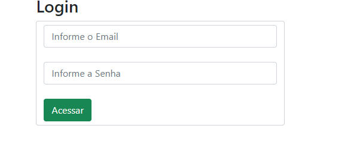
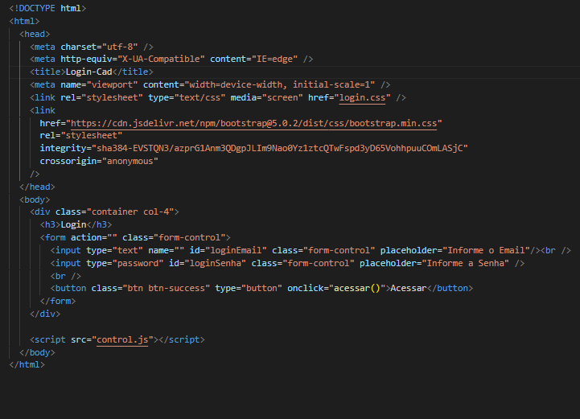

# tela de login

## essa ea primeira parate do codigo onde você devera fazer o login para poder se cadastrar 



este trabalho foi criado com javaScript para poder estilizar e para realizar as funções do site


```
function acessar(){
   let loginEmail = document.getElementById('loginEmail').value;
   let loginSenha = document.getElementById('loginSenha').value;

      if(!loginEmail || !loginSenha){
         alert('favor preencher todos os campos');

      }else{
       // else{ alert('campos preenchisdos com sucesso'); }
       window.location.hrefc = 'cadastro.html'
      }
}
 ```

esse codigo e para poder cadastrar a senha e E-mail, e se ney um dos campos dos campos sera informado "porfavor preencher todos os campos", ese os campos forem prenchidos sera informado "campos preenchiodos com suceso"

## nesse trabalho tambem foi usado HTML para poder dar estructura ao site 

 ```
<!DOCTYPE html>
<html>
  <head>
    <meta charset="utf-8" />
    <meta http-equiv="X-UA-Compatible" content="IE=edge" />
    <title>Login-Cad</title>
    <meta name="viewport" content="width=device-width, initial-scale=1" />
    <link rel="stylesheet" type="text/css" media="screen" href="login.css" />
    <link
      href="https://cdn.jsdelivr.net/npm/bootstrap@5.0.2/dist/css/bootstrap.min.css"
      rel="stylesheet"
      integrity="sha384-EVSTQN3/azprG1Anm3QDgpJLIm9Nao0Yz1ztcQTwFspd3yD65VohhpuuCOmLASjC"
      crossorigin="anonymous"
    />
 ```

  ```
 </head>
  <body>
    <div class="container col-4">
      <h3>Login</h3>
      <form action="" class="form-control">
        <input type="text" name="" id="loginEmail" class="form-control" placeholder="Informe o Email"/><br />
        <input type="password" id="loginSenha" class="form-control" placeholder="Informe a Senha" />
        <br />
        <button class="btn btn-success" type="button" onclick="acessar()">Acessar</button>
      </form>
    </div>
 
    <script src="control.js"></script>
  </body>
</html>
  </head>
  <body>
    <div class="container col-4">
      <h3>Login</h3>
      <form action="" class="form-control">
        <input type="text" name="" id="loginEmail" class="form-control" placeholder="Informe o Email"/><br />
        <input type="password" id="loginSenha" class="form-control" placeholder="Informe a Senha" />
        <br />
        <button class="btn btn-success" type="button" onclick="acessar()">Acessar</button>
      </form>
    </div>
 
    <script src="control.js"></script>
  </body>
</html> 
```



imagem ilustartiva do HTML


# tela de cadrastro


## este trabalho foi dessenvolvido para cadreastrar nomes, e ao mesmo tempo pode eliminae ou editar o nome das pessoas, não tendo limite de nomes para cadastrar.

 
 
 
 


para realizar a função de eliminar e editar os nome foi usando javaScript
  
  
  ``` 
  var dadosLista = [];
function salvarUser(){
   let nomeUser = document.getElementById('nomeUser').value;

   if(nomeUser){
      dadosLista.push(nomeUser);
      // console.log(dadosLista);
      criarLista()
      document.getElementById('nomeUser').value = "";
   }else{
      alert('porfavor iforme um nome para cadastro');
   }


}

   ```
   FUNÇÃO PARA ARMAZENAMENTO DE NOMES EM ARRAY

   ARRAY:Um array (arranjo ou vetor) é um conjunto de dados (que pode assumir os mais diversos tipos, desde do tipo primitivo, a objeto dependendo da linguagem de programação). Arrays são utilizados para armazenar mais de um valor em uma única variável. Isso é comparável a uma variável que pode armazenar apenas um valor


 ```
   function criarLista(){
    let tabela = document.getElementById('tabela').innerHTML = "<tr> <th>Nome Usuario</th><th>Acões</th></tr>";
    for(let i=0;i <=(dadosLista.length - 1);i++){
         tabela += "<tr><td>" + dadosLista[i] + "</td><td><button type='button' onclick='editar(parentNode.parentNode.rowIndex)'>Editar</button><button type='button' onclick='excluir(parentNode.parentNode.rowIndex)'>Excluir</button></td></tr>";
      document.getElementById('tabela').innerHTML = tabela;
    }

}
 ```
 funçao para criar listas de usuario

 ```
 function editar(i){
   document.getElementById('nomeUser').value = dadosLista[(i-1)]
   dadosLista.splice(dadosLista[(i - 1)],1);
}  
 ```
  função para editar nomes de listas 

 ```function excluir(i){
   dadosLista.splice((i - 1), 1);
   document.getElementById('tabela').deleteRow(i);

  ```
  função para excluir nome de lista 


  


  imagem ilustrativa do codigo


  ### Tambem para criar esse codigi foi usados outras elementos como o HTML, que foi usado para dar estructura ao codigo  
 ```  
<!DOCTYPE html>
<html>
 
<head>
  <meta charset="utf-8" />
  <meta http-equiv="X-UA-Compatible" content="IE=edge" />
  <title>Cadastro</title>
  <meta name="viewport" content="width=device-width, initial-scale=1" />
  <link rel="stylesheet" type="text/css" media="screen" href="main.css" />
  <link href="https://cdn.jsdelivr.net/npm/bootstrap@5.0.2/dist/css/bootstrap.min.css" rel="stylesheet"
    integrity="sha384-EVSTQN3/azprG1Anm3QDgpJLIm9Nao0Yz1ztcQTwFspd3yD65VohhpuuCOmLASjC" crossorigin="anonymous" />
</head>
 ```

  ```  />
  </head>
  <body>
    <div class="container col-4">
      <h3>Login</h3>
      <form action="" class="form-control">
        <input type="text" name="" id="loginEmail" class="form-control" placeholder="Informe o Email"/><br />
        <input type="password" id="loginSenha" class="form-control" placeholder="Informe a Senha" />
        <br />
        <button class="btn btn-success" type="button" onclick="acessar()">Acessar</button>
      </form>
    </div>
 
    <script src="control.js"></script>
  </body>
</html>
 
 
  ```
  codigo do  HTML

  tecnologias usadas:


  


